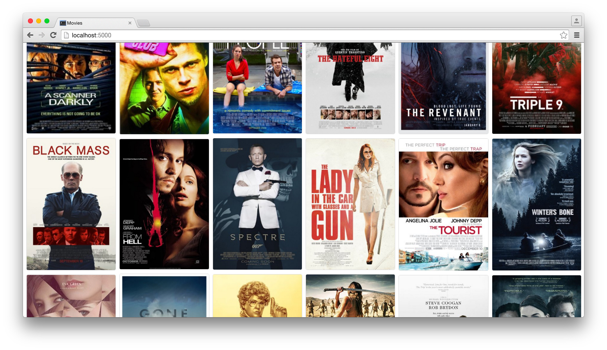

fluid
===

Browse your local movies with IMDB data and stream them to a Chromecast.




> The [Open Movie Database API](http://www.omdbapi.com/) is used to fetch data
> about your media files -- including the poster.

## Required

- A Chromecast - specifically its name
- A directory of media  - formatted like `some.title.year.quality.format`

## Setup

Install the required python packages:
```bash
$ pip install -r requirements.txt
```

Export a few required environment variables:
```bash
$ export CHROMECAST_IP=10.0.0.72
$ export MEDIA_PATH=/media/usbhdd/movies
$ export SECRET_KEY=,n\xa7\xdfq\x08h\xb8\x8c\x8af.B\x93y*\xd3\xf5\x10;
```

Run the server:
```bash
$ python app.py --host 0.0.0.0 --port 5000 --debug
```
